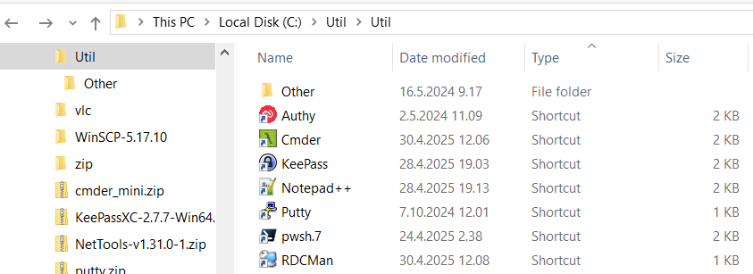
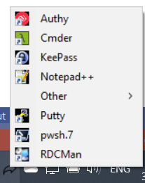

# WinSysTryIcon
Runn app and put it in Windows system try. Right click shows context menu to launch other app.

## How to use it
### Create folder and put shortcuts there
Create folder. Drag and drop executable files from any location. Before releasin mouse button, press keys Ctrl+Shift. Instead of copying/moving file to folder, shortcut will be created.  
Shortcuts have extension .lnk, application filters files with extension lnk, and adds menu item for each link

### Edit ini file
Edit file WinSysTray.ini. Specify path to folder where shortcuts are created
```
[startup]
Folder=c:\Util
```
### Run application
When running, application seats in system tray. Left mouse click on application icon will show popup menu.  

Right mouse button click will open settings menu
